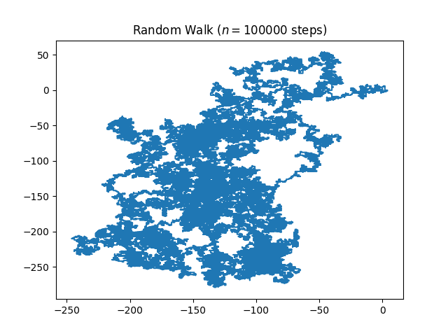

# Random Walk Simulation

This is a **group exercise**, so you should be working in pairs of two students. It's **30% of your final grade**. 

The Goal is to **practise writing readable, maintainable and reliable code collaboratively.**


## Write an extended random walk program 

In this repo you find a basic implementation of a [random walk simulation](https://en.wikipedia.org/wiki/Random_walk) in 2-dimensional space taken from [this blogpost](https://www.geeksforgeeks.org/random-walk-implementation-python/). Running the code yields an image which shows the path of the random walk. 



## Setting up the project
1. clone repository
2. setup a virtual environment
3. activate the virtual environment
4. install required libs and packages locally (see requirements.txt)

#### For the advanced geoscripting course:
- activate the corresponding virtual environment
- run ``conda install -c conda-forge click``
- run ``pip install --editable .`` (is this actually necessary? can someone try to run it without this step?)


## How to run the tool
````
$ random_walker

Usage: random_walker [OPTIONS] COMMAND [ARGS]...

Options:
  --verbose TEXT  Will print verbose messages.
  --help          Show this message and exit.

Commands:
  run  execute command to generate random walkers
  ````

### How to use the run method
````
Usage: random_walker run [OPTIONS]

  execute command to generate random walkers

Options:
  -ts, --total_steps INTEGER    Specify the number of total steps for the
                                random walker, Default is 10,000

  -tw, --total_walkers INTEGER  Specify the number of total walkers, Default
                                is 1

  -ss, --step_size INTEGER      Specify the size of the steps taken, Default
                                is 1

  -l, --landscape BOOLEAN       Specify whether a grid landscape exists as
                                base layer or not, Default is False

  -sp, --start_point BOOLEAN    Specify whether the walkers shall start from
                                the same point or not, Default is False

  --help                        Show this message and exit.

````

## Example
``random_walker run --total_steps 10000 --step_size 2 -l False``

4. Document the dependencies and instructions of how to run the program in your README.md.


